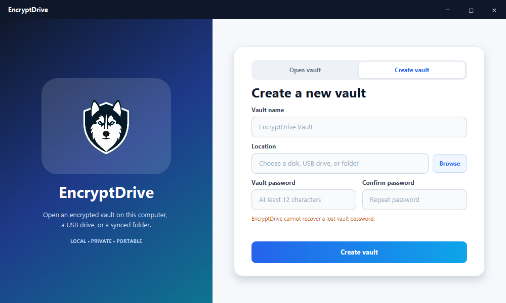
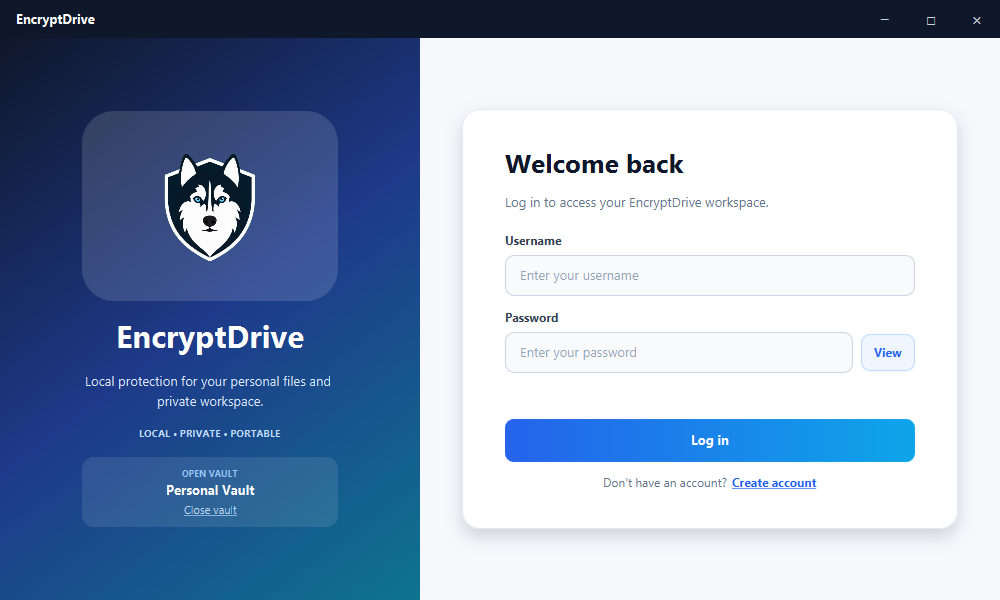
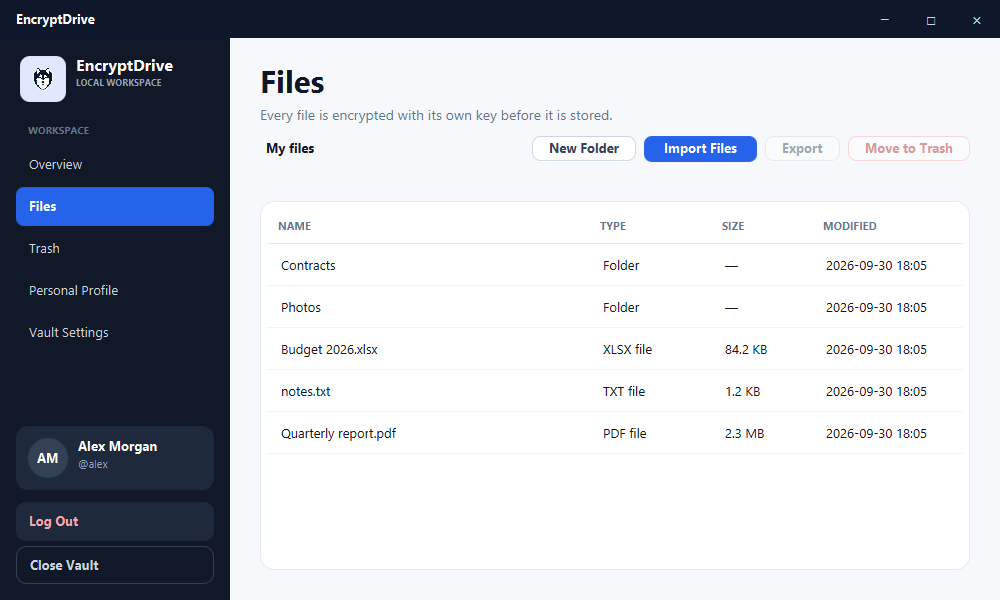

<p align="center">
  
</p>

<h1 align="center">EncryptDrive</h1>

<p align="center">
  A local-first desktop app that keeps your files in an encrypted, portable vault.
</p>

---

## What it does

EncryptDrive creates an encrypted **vault** in any folder you choose: your own
disk, a USB drive, or a folder synced by OneDrive. Several people can have
accounts in the same vault, and each person can only ever decrypt their own
files.

Account names, file and folder names, and file contents in the vault are
encrypted. The only plaintext vault metadata is a small `vault.json` header;
EncryptDrive also uses a lock file while the vault is open. It works fully
offline: there is no server, cloud account, telemetry, or network access.

## Screenshots

| Vault selection | Log in | Files |
|---|---|---|
|  |  |  |

The screenshots use a demo vault and a fictional account.

## How it works

- **Two passwords, two layers.** The vault password unlocks the encrypted list
  of accounts. Each account password unlocks that account's own key, which is
  the only way to decrypt that account's files.
- **One key per file.** Every file is encrypted with its own random key using
  AES-256-GCM, streamed in small chunks so even very large files use little
  memory. Tampering with any byte makes decryption fail instead of producing
  wrong data.
- **Passwords are never stored.** Keys are derived with Argon2id (64 MiB,
  3 iterations). Changing a password rewraps a key; nothing is re-encrypted.
- **Safe writes.** Metadata is replaced atomically, with three encrypted backup
  generations that are restored automatically if the current copy is damaged.
- **One process at a time.** A lock file keeps a second EncryptDrive process
  from opening a vault that is already open.

The details are in [docs/SECURITY.md](docs/SECURITY.md) and the exact file
format is in [docs/VAULT_FORMAT.md](docs/VAULT_FORMAT.md).

## Download and install

The Windows release has two editions:

- **Installer:** run `EncryptDrive-<version>-Setup.exe`. If SmartScreen reports
  an unknown publisher, verify the SHA-256 checksum first, then choose **More
  info → Run anyway**. The per-user wizard lets you choose the install folder,
  add a Start Menu entry, and optionally add a desktop shortcut. It does not
  ask for administrator access.
- **Portable:** unzip `EncryptDrive-<version>-Windows-Portable.zip` anywhere
  and run `EncryptDrive\EncryptDrive.exe`. It also works from a USB drive.

Both editions bundle Java and need no separate Java installation. Installing
EncryptDrive does not choose, create, or move a vault; uninstalling it never
deletes a vault. Create and open vaults from inside the app.

Verify the downloaded installer against `SHA256SUMS.txt` using the PowerShell
commands in [the release notes footer](docs/testing/release-notes-footer.md).

## Using EncryptDrive

### Create or open a vault

EncryptDrive starts on **Vault Selection**.

- **Create vault:** choose a name and a location (disk, USB drive, or synced
  folder), then set a vault password of at least 12 characters. EncryptDrive
  creates a new folder with that name and asks you to register the first
  account.
- **Open vault:** choose an existing vault folder and enter its vault
  password. You land on the login screen.

> **There is no password recovery.** If you forget the vault password, the
> vault cannot be opened. If you forget an account password, that account's
> files cannot be decrypted. Nobody, including the author, can reset them.

### Accounts

- **Create account** adds a local account to the open vault (username of at
  least 3 characters, password of at least 12). Accounts created by pre-release
  builds with shorter passwords still work; change those passwords in Personal
  Profile.
- **Log in** opens that account's workspace.
- **Log Out** ends the account session and returns to login; the vault stays
  open for the next person.
- **Close Vault** (sidebar, Vault Settings, or the login screen) signs out,
  erases the vault keys from memory, and releases the vault.

### Files

The workspace sidebar has **Overview**, **Files**, **Trash**,
**Personal Profile**, and **Vault Settings**.

- **Import** offers **Files…** and **Folder…**. Files encrypt copies into the
  current folder. Folder imports include subfolders and empty folders; links
  and junctions are skipped. Both actions show progress, and originals stay
  where they are.
- **New Folder**, double-click to open a folder, and use the breadcrumbs to go
  back. **Rename** and **Move** change items inside your encrypted workspace.
- **Search** searches only your own files. Press Enter to search; select
  **Clear** to return to the current folder. Results show their location, and
  double-clicking a result opens its folder.
- **Export** writes decrypted copies to a location you choose, after warning
  that exported files are no longer protected by EncryptDrive. Exports into the
  vault folder are refused. Files are never opened as temporary plaintext.
- **Move to Trash** hides items but keeps them encrypted. In **Trash** you can
  **Restore**, **Permanently Delete**, or **Empty Trash** after confirmation.
- **Personal Profile** changes your account password; **Vault Settings**
  shows the vault details and changes the vault password.

### USB drives and OneDrive

A vault is just a folder, so you can keep it on a USB drive and open it on
another Windows computer with the portable build. Keep the portable app on the
USB drive beside the vault if convenient. Close the vault and EncryptDrive
before ejecting the drive.

In a OneDrive (or similar) folder, the provider only ever receives encrypted
data.

**Never open the same synced vault on two computers at the same time. Close
EncryptDrive and wait for sync to finish before switching computers.**

## Versions and tags

- `1.0.0-SNAPSHOT` is the development version.
- `v1.0.0-rc.N` tags a release candidate for testing; it is a prerelease.
- `v1.0.0` tags the stable release.

## Building and running

Requirements: JDK 21 and Maven for source work; Windows release packaging also
needs WiX Toolset 3.14 on `PATH`. The portable and installed builds bundle a
Java runtime and need no separate Java installation on the computer that runs
them.

```bash
# Run from source
mvn javafx:run

# Run all tests
mvn -B clean verify
```

Build the portable and installer Windows editions with their own Java runtime.
Artifacts are written to `target/release/<version>/`.

```powershell
powershell -NoProfile -ExecutionPolicy Bypass -File scripts/build-release.ps1
powershell -NoProfile -ExecutionPolicy Bypass -File scripts/verify-package.ps1 -Launch -Install
```

The portable ZIP can be moved to another directory or a USB drive. Choose the
vault location from inside EncryptDrive; installing or moving the app does not
move the vault.

### Tests

`mvn -B clean verify` runs the unit and integration tests: key derivation against
reference vectors, AES-GCM tamper cases, vault and account lifecycles,
encrypted storage, cross-account isolation, a corruption and recovery matrix,
and JavaFX layout and flow checks. The JavaFX tests are skipped automatically
where no desktop session is available.

A 1 GiB streaming check is opt-in and uses a 256 MiB Java heap:

```bash
mvn -B test "-Dtest=LargeFileStreamingTest" "-Dencryptdrive.largeFileCheck=true" "-DargLine=-Xmx256m"
```

The manual UI checklist is in [docs/testing/manual-ui.md](docs/testing/manual-ui.md).
The release gates and hardware checks are in
[docs/testing/release-checklist.md](docs/testing/release-checklist.md).

## Project structure

```text
src/main/java/com/fabianrodas/
├── encryptdrive/   JavaFX app and FXML controllers (no crypto or file I/O)
├── models/         data classes: vault header, envelopes, accounts, manifests
├── security/       Argon2id, AES-GCM, associated data, key wiping
├── repositories/   atomic, backed-up persistence of vault files and blobs
├── services/       vault lifecycle, accounts, sessions, files, recovery
└── utils/          window dragging

src/main/resources/com/fabianrodas/
├── encryptdrive/   FXML views
├── css/            stylesheets
└── images/         logo

packaging/windows/  Windows installer resources
scripts/            portable Windows packaging and package verification
docs/               security model, vault format, compatibility, and test checklists
```

## Known limitations

- EncryptDrive protects data at rest. It cannot protect against malware,
  keyloggers, or an administrator on the computer where the vault is open.
- File sizes and the number of files and accounts are visible from the vault
  folder, although names and contents are not.
- Exported files, and originals you imported, are ordinary plaintext files.
- SSDs and flash drives cannot guarantee that deleted data is physically
  erased.
- The same synced vault must not be used from two computers at once.

See [docs/SECURITY.md](docs/SECURITY.md) for the full threat model.

## Author

Developed by Fabián Rodas.

Copyright © 2026 Fabián Rodas. All rights reserved.
